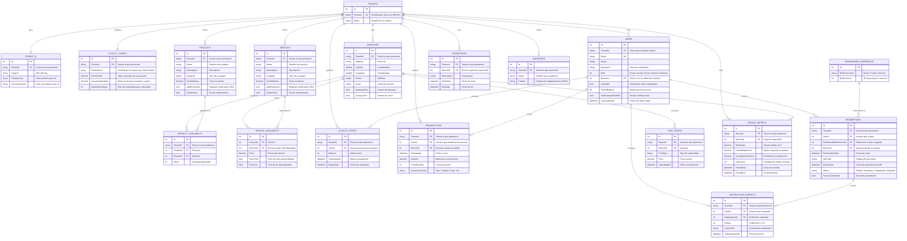

```mermaid
erDiagram
    TENANTS {
        int Id PK
        string TenantId UK "Identificador único (ej: ANCAP)"
        string Name "Nombre de la cadena"
    }
    
    TENANT_UI {
        int Id PK
        string TenantId FK "Tenant al que pertenece"
        string LogoUrl "URL del logo"
        string PrimaryColor "Color primario para UI"
        string SecondaryColor "Color secundario para UI"
    }
    
    LOYALTY_CONFIG {
        int Id PK
        string TenantId FK "Tenant al que pertenece"
        string PointsName "Nombre de los puntos (ej: ServiPuntos)"
        decimal PointsValue "Valor monetario de cada punto"
        decimal AccumulationRule "Monto en $ para acumular 1 punto"
        int ExpiryPolicyDays "Días de inactividad para caducidad"
    }
    
    USERS {
        int Id PK
        string TenantId FK "NULL para usuarios Central"
        string Email UK
        string Name
        string Password "Hash de contraseña"
        int Role "Enum: Central, Tenant, Branch, EndUser"
        int BranchId FK "NULL si no es admin de estación"
        bool IsVerified "Verificación VEAI completada"
        int PointsBalance "Saldo actual de puntos"
        bool NotificationsEnabled "Recibir notificaciones"
        datetime LastLoginDate "Fecha del último login"
    }
    
    BRANCHES {
        int Id PK
        string TenantId FK "Tenant al que pertenece"
        string Address "Dirección"
        double Latitude "Coordenadas"
        double Longitude "Coordenadas"
        string Phone "Teléfono"
        string Email "Email de contacto"
        time OpeningTime "Horario de apertura"
        time ClosingTime "Horario de cierre"
    }
    
    PRODUCTS {
        int Id PK
        string TenantId FK "Tenant al que pertenece"
        string Name "Nombre del producto"
        string Description "Descripción"
        string ImageUrl "URL de la imagen"
        decimal CostInMoney "Costo en dinero"
        bool AgeRestricted "Requiere verificación VEAI"
        bool NotifyUsers "Enviar notificaciones"
    }
    
    SERVICES {
        int Id PK
        string TenantId FK "Tenant al que pertenece"
        string Name "Nombre del servicio"
        string Description "Descripción"
        string ImageUrl "URL de la imagen"
        decimal CostInMoney "Costo en dinero"
        bool AgeRestricted "Requiere verificación VEAI"
        bool NotifyUsers "Enviar notificaciones"
    }
    
    REDEEMABLE_REFERENCE {
        int Id PK
        string ReferenceType "Enum: Product, Service"
        int ReferenceId "ID del producto o servicio"
    }
    
    PRODUCT_AVAILABILITY {
        int Id PK
        string TenantId FK "Tenant al que pertenece"
        int ProductId FK "Producto"
        int BranchId FK "Estación"
        int Stock "Cantidad disponible"
    }
    
    SERVICE_AVAILABILITY {
        int Id PK
        int ServiceId FK "Servicio"
        int BranchId FK "Branch donde está disponible"
        decimal Price "Precio del servicio"
        time StartTime "Hora de inicio disponibilidad"
        time EndTime "Hora de fin disponibilidad"
    }
    
    LOYALTY_POINTS {
        int Id PK
        string TenantId FK "Tenant al que pertenece"
        int UserId FK "Usuario que posee los puntos"
        int Balance "Saldo actual"
        datetime LastUpdated "Última actualización"
        datetime ExpiryDate "Fecha de caducidad"
    }
    
    TRANSACTIONS {
        int Id PK
        string TenantId FK "Tenant al que pertenece"
        int UserId FK "Usuario que realizó la transacción"
        int BranchId FK "Estación donde se realizó"
        datetime Timestamp "Fecha y hora"
        decimal Amount "Monto de la transacción"
        int PointsEarned "Puntos ganados"
        string TransactionType "Tipo: Compra, Canje, etc."
    }
    
    PROMOTIONS {
        int Id PK
        string TenantId FK "Tenant al que pertenece"
        int BranchId FK "Branch específica (opcional)"
        string Description "Descripción"
        datetime StartDate "Fecha de inicio"
        datetime EndDate "Fecha de fin"
    }
    
    AUDIENCES {
        int Id PK
        string TenantId FK "Tenant al que pertenece"
        string Name "Nombre de la audiencia"
        string Criteria "Criterios de segmentación (JSON)"
    }
    
    REDEMPTIONS {
        int Id PK
        string TenantId FK "Tenant al que pertenece"
        int UserId FK "Usuario que canjeó"
        int RedeemableReferenceId FK "Referencia al ítem canjeado"
        int BranchId FK "Estación donde se canjeó"
        datetime RedemptionDate "Fecha de canje"
        string QRCode "Código QR generado"
        datetime ExpiryDate "Fecha de expiración del QR"
        string Status "Estado: Pendiente, Completado, Expirado"
        bool SurveyCompleted "Encuesta completada"
    }
    
    SATISFACTION_SURVEYS {
        int Id PK
        string TenantId FK "Tenant al que pertenece"
        int UserId FK "Usuario que respondió"
        int RedemptionId FK "Redención evaluada"
        int Rating "Calificación 1-10"
        string Comments "Comentarios opcionales"
        datetime SubmissionDate "Fecha de envío"
    }
    
    FUEL_PRICES {
        int Id PK
        string TenantId FK "Tenant al que pertenece"
        int BranchId FK "Estación"
        string FuelType "Tipo de combustible"
        decimal Price "Precio actual"
        datetime LastUpdated "Última actualización"
    }
    
    TENANT_METRICS {
        int Id PK
        string TenantId FK "Tenant al que pertenece"
        int BranchId FK "Estación específica"
        decimal TotalSales "Ventas totales en $"
        decimal PointsRedeemed "Monto canjeado en puntos"
        decimal AverageSatisfaction "Promedio de satisfacción"
        int VisitCount "Cantidad de visitas al tenant"
        datetime PeriodStart "Inicio del período"
        datetime PeriodEnd "Fin del período"
    }
    
    TENANTS ||--|| TENANT_UI : "tiene"
    TENANTS ||--|| LOYALTY_CONFIG : "configura"
    TENANTS ||--o{ USERS : "tiene"
    TENANTS ||--o{ BRANCHES : "tiene"
    TENANTS ||--o{ LOYALTY_POINTS : "gestiona"
    TENANTS ||--o{ TRANSACTIONS : "registra"
    TENANTS ||--o{ PRODUCTS : "ofrece"
    TENANTS ||--o{ SERVICES : "ofrece"
    TENANTS ||--o{ PROMOTIONS : "crea"
    TENANTS ||--o{ AUDIENCES : "define"
    TENANTS ||--o{ TENANT_METRICS : "mide"
    BRANCHES ||--o{ PRODUCT_AVAILABILITY : "mantiene"
    BRANCHES ||--o{ SERVICE_AVAILABILITY : "ofrece"
    BRANCHES ||--o{ FUEL_PRICES : "actualiza"
    BRANCHES ||--o{ TENANT_METRICS : "genera"
    USERS ||--o{ LOYALTY_POINTS : "acumula"
    USERS ||--o{ TRANSACTIONS : "realiza"
    USERS ||--o{ REDEMPTIONS : "solicita"
    USERS ||--o{ SATISFACTION_SURVEYS : "completa"
    PRODUCTS ||--o{ PRODUCT_AVAILABILITY : "disponible en"
    SERVICES ||--o{ SERVICE_AVAILABILITY : "disponible en"
    REDEEMABLE_REFERENCE ||--o{ REDEMPTIONS : "referenciado en"
    REDEMPTIONS ||--o{ SATISFACTION_SURVEYS : "genera"
```